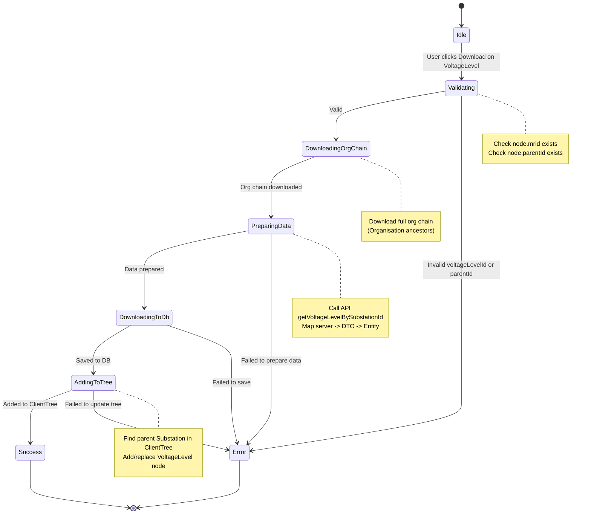

# Kế hoạch: Download VoltageLevel từ ServerTree về ClientTree

## Context
- **Bài toán**: Ứng dụng hiện tại đã có chức năng download Organisation và Substation từ ServerTree về ClientTree, nhưng chưa hỗ trợ download riêng VoltageLevel
- **Mục tiêu**: Thêm chức năng cho phép user chọn một VoltageLevel trong ServerTree và download về ClientTree
- **Yêu cầu**: Download đầy đủ chain tổ tiên (Organisation → Substation) + chính VoltageLevel được chọn (KHÔNG bao gồm Bay/Asset descendants)

## Các file quan trọng đã có sẵn

| File | Mô tả |
|------|-------|
| `src/views/TreeNode/Server/mixin/Download/downloadNode.js` | Logic download chính - thêm xử lý voltageLevel mode |
| `src/api/demo/index.js:30` | `getVoltageLevelBySubstationId` API để lấy voltageLevel từ server |
| `src/views/Mapping/ServerToDTO/VoltageLevel/index.js` | Map server data → DTO |
| `src/views/Mapping/VoltageLevel/index.js` | Map DTO → Entity |
| `src/function/cim/voltageLevel/index.js` | Database functions (insertVoltageLevel, insertVoltageLevelTransaction) |
| `src/views/TreeNode/Server/mixin/fetchChildrenServer.js:81` | ServerTree hiển thị voltageLevel với mode='voltageLevel' |

---

## Implementation Plan

### Bước 1: Thêm xử lý VoltageLevel mode trong downloadNode.js

**File**: `src/views/TreeNode/Server/mixin/Download/downloadNode.js`

Thêm condition xử lý `node.mode === 'voltageLevel'` trong hàm `handleDownloadNode()`, tương tự như xử lý 'substation':

```javascript
} else if (node.mode === 'voltageLevel') {
    // STAGE 1: VOLTAGE LEVEL DOWNLOAD
    console.log('[STAGE 1] VoltageLevel mode - START')

    // Validate: mrid exists
    const voltageLevelId = node.mrid || node.id
    if (!voltageLevelId) {
        this.$message.error('VoltageLevel ID not found')
        return
    }

    // Validate: parent substation exists
    const parentSubstationId = node.parentId
    if (!parentSubstationId) {
        this.$message.error('Parent substation not found')
        return
    }

    // Download full organisation chain first
    try {
        const parentNode = this.findNodeById(parentSubstationId, this.ownerServerList)
        if (parentNode && parentNode.parentId) {
            const orgNode = this.findNodeById(parentNode.parentId, this.ownerServerList)
            if (orgNode) {
                await this.downloadOrganisationChainForParent(orgNode)
            }
        }
    } catch (error) {
        console.error('[STAGE 1] Error downloading org chain:', error)
    }

    // Proceed to download VoltageLevel
    try {
        const result = await this.downloadVoltageLevelToDb(node, parentSubstationId)
        if (result.success) {
            this.$message.success('VoltageLevel downloaded successfully!')
        } else {
            this.$message.error('Download failed: ' + result.message)
        }
    } catch (error) {
        console.error('[STAGE 1] Error in voltageLevel download:', error)
        this.$message.error('VoltageLevel download failed: ' + error.message)
    }

    return
}
```

---

### Bước 2: Tạo hàm prepareVoltageLevelDownloadData

**File**: `src/views/TreeNode/Server/mixin/Download/downloadNode.js`

Tạo hàm chuẩn bị dữ liệu VoltageLevel (tương tự prepareSubstationDownloadData):

```javascript
// STAGE 2: Prepare VoltageLevel Download Data
async prepareVoltageLevelDownloadData(node) {
    console.log('[STAGE 2] prepareVoltageLevelDownloadData - START')

    const voltageLevelId = node.mrid || node.id
    if (!voltageLevelId) {
        throw new Error('VoltageLevel ID not found')
    }

    // Gọi API lấy chi tiết voltageLevel
    const voltageLevelData = await demoAPI.getVoltageLevelBySubstationId(node.parentId)
        .then(data => data.find(vl => vl.mRID === voltageLevelId || vl.mrid === voltageLevelId))

    if (!voltageLevelData) {
        throw new Error('VoltageLevel not found on server')
    }

    const voltageLevelObj = {
        id: voltageLevelId,
        mrid: String(voltageLevelId),
        name: voltageLevelData?.name || node.name || '',
        aliasName: voltageLevelData?.shortName || voltageLevelData?.name || node.aliasName || node.name || '',
        _type: 'voltageLevel',
        _serverData: voltageLevelData,
        parentId: node.parentId
    }

    return {
        voltageLevel: voltageLevelObj,
        parentSubstationId: node.parentId
    }
}
```

---

### Bước 3: Tạo hàm downloadVoltageLevelToDb

**File**: `src/views/TreeNode/Server/mixin/Download/downloadNode.js`

Tạo hàm lưu VoltageLevel vào database local (tương tự downloadSubstationToDb):

```javascript
// STAGE 3: Download VoltageLevel to DB
async downloadVoltageLevelToDb(voltageLevel, parentSubstationId) {
    console.log('[STAGE 3] downloadVoltageLevelToDb - START')

    const VoltageLevelServerMapper = require('@/views/Mapping/ServerToDTO/VoltageLevel/index.js')
    const VoltageLevelMapper = require('@/views/Mapping/VoltageLevel/index.js')
    const VoltageLevelEntity = require('@/views/Flatten/VoltageLevel/index.js').default

    // Map server data → DTO → Entity
    const serverData = {
        ...voltageLevel._serverData,
        mRID: voltageLevel.mrid,
        substation: { mRID: parentSubstationId }
    }

    const dto = VoltageLevelServerMapper.mapServerToDto(serverData)
    const entity = VoltageLevelMapper.volDtoToVolEntity(dto)

    // Check exists in local DB
    const existingResult = await window.electronAPI.getVoltageLevelEntityByMrid(voltageLevel.mrid)

    let oldEntity
    if (existingResult.success && existingResult.data) {
        oldEntity = existingResult.data
    } else {
        oldEntity = new VoltageLevelEntity()
    }

    // Save to local DB
    const insertResult = await window.electronAPI.insertVoltageLevelEntity(oldEntity, entity)

    if (insertResult.success) {
        console.log('[STAGE 3] ✅ VoltageLevel downloaded successfully:', voltageLevel.name)

        // Refresh client tree - add voltageLevel node
        await this.addVoltageLevelToClientTree(voltageLevel, parentSubstationId)

        return { success: true }
    } else {
        console.error('[STAGE 3] ❌ Failed to download voltageLevel:', voltageLevel.name)
        return { success: false, message: insertResult.message }
    }
}
```

---

### Bước 4: Tạo hàm addVoltageLevelToClientTree

**File**: `src/views/TreeNode/Server/mixin/Download/downloadNode.js`

Tạo hàm cập nhật ClientTree sau khi download (tương tự logic trong downloadSubstationToDb):

```javascript
// Add VoltageLevel node to ClientTree
async addVoltageLevelToClientTree(voltageLevel, parentSubstationId) {
    console.log('[STAGE 3.9] Adding voltageLevel to client tree...')

    // Find parent substation in client tree
    const parentNode = this.findNodeById(parentSubstationId, this.organisationClientList)

    if (parentNode) {
        const children = parentNode.children || []
        const newVoltageLevelNode = {
            mrid: voltageLevel.mrid,
            name: voltageLevel.name,
            aliasName: voltageLevel.aliasName,
            parentId: parentSubstationId,
            mode: 'voltageLevel'
        }

        const existingIndex = children.findIndex(c => c.mrid === voltageLevel.mrid)
        if (existingIndex >= 0) {
            children[existingIndex] = newVoltageLevelNode
        } else {
            children.push(newVoltageLevelNode)
        }

        this.$set(parentNode, 'children', children)
        this.$set(parentNode, 'expanded', true)

        console.log('[STAGE 3.9] ✅ VoltageLevel added to client tree successfully')
    }
}
```

---

### Bước 5: Kiểm tra API đã tồn tại

Đã xác nhận các API sau đã tồn tại:
- `src/ipcmain/entity/voltageLevel/index.js` - IPC handlers
- `src/preload/entity/voltageLevel/index.js` - Preload functions
- `getVoltageLevelEntityByMrid`
- `insertVoltageLevelEntity`

---

## Verification

1. Chạy ứng dụng
2. Mở ServerTree, expand Substation node
3. Right-click hoặc chọn một VoltageLevel node
4. Click Download button
5. Verify:
   - Tổ tiên (Organisation) được download về ClientTree
   - Substation cha được download về ClientTree
   - VoltageLevel được download về ClientTree
   - ClientTree hiển thị đúng hierarchy: Organisation → Substation → VoltageLevel

---

## State Machine Diagram

```
+-----------------------------------------------------------------------------+
|                        DOWNLOAD VOLTAGE LEVEL FLOW                           |
+-----------------------------------------------------------------------------+

[START]
    |
    v
+-----------------------------------------------------------------------------+
| handleDownloadNode()                                                        |
|                                                                             |
|  +---------------------------------------------------------------------+   |
|  | Check: node.mode === 'voltageLevel'                                 |   |
|  +---------------------------------------------------------------------+   |
|         |                                                                   |
|         v YES                                                               |
|                                                                             |
|  +---------------------------------------------------------------------+   |
|  | STAGE 1.1: VALIDATE                                                 |   |
|  |  * voltageLevelId = node.mrid                                      |   |
|  |  * parentSubstationId = node.parentId                              |   |
|  |                                                                     |   |
|  | IF NOT voltageLevelId -> ERROR: "VoltageLevel ID not found"        |   |
|  | IF NOT parentSubstationId -> ERROR: "Parent substation not found" |   |
|  +---------------------------------------------------------------------+   |
|         |                                                                   |
|         v                                                                   |
|  +---------------------------------------------------------------------+   |
|  | STAGE 1.2: DOWNLOAD ORGANISATION CHAIN                              |   |
|  |                                                                     |   |
|  |  * Find parentSubstation in ServerTree                              |   |
|  |  * Find organisation node (parentSubstation.parentId)              |   |
|  |  * Call downloadOrganisationChainForParent(orgNode)               |   |
|  |    +-----------------------------------------------------------+   |   |
|  |    | downloadOrganisationChainForParent()                       |   |   |
|  |    |                                                            |   |   |
|  |    |  * prepareOrganisationDownloadData(parentNode)            |   |   |
|  |    |  * downloadOrganisationChain(chain)                        |   |   |
|  |    |                                                            |   |   |
|  |    |  [OUTPUT: All ancestor organisations in local DB]         |   |   |
|  |    +-----------------------------------------------------------+   |   |
|  |                                                                     |   |
|  |  [OUTPUT: Full organisation chain in local DB]                    |   |
|  +---------------------------------------------------------------------+   |
|         |                                                                   |
|         v                                                                   |
|  +---------------------------------------------------------------------+   |
|  | STAGE 2: PREPARE VOLTAGE LEVEL DATA                                 |   |
|  |                                                                     |   |
|  |  prepareVoltageLevelDownloadData(node)                              |   |
|  |                                                                     |   |
|  |  * Call API: getVoltageLevelBySubstationId(parentSubstationId)    |   |
|  |  * Find voltageLevel with matching mRID                            |   |
|  |  * Build voltageLevelObj with:                                     |   |
|  |      - id, mrid, name, aliasName                                   |   |
|  |      - _type: 'voltageLevel'                                       |   |
|  |      - _serverData: raw server data                                 |   |
|  |      - parentId: parentSubstationId                                |   |
|  |                                                                     |   |
|  |  [OUTPUT: voltageLevelObj, parentSubstationId]                     |   |
|  +---------------------------------------------------------------------+   |
|         |                                                                   |
|         v                                                                   |
|  +---------------------------------------------------------------------+   |
|  | STAGE 3: DOWNLOAD VOLTAGE LEVEL TO DB                              |   |
|  |                                                                     |   |
|  |  downloadVoltageLevelToDb(voltageLevel, parentSubstationId)        |   |
|  |                                                                     |   |
|  |  3.1 Map Server -> DTO -> Entity                                   |   |
|  |      * VoltageLevelServerMapper.mapServerToDto()                   |   |
|  |      * VoltageLevelMapper.volDtoToVolEntity()                      |   |
|  |                                                                     |   |
|  |  3.2 Check existing in local DB                                     |   |
|  |      * getVoltageLevelEntityByMrid(voltageLevel.mrid)              |   |
|  |      * IF exists -> update (oldEntity)                              |   |
|  |      * IF not exists -> create new entity                           |   |
|  |                                                                     |   |
|  |  3.3 Insert to local DB                                             |   |
|  |      * insertVoltageLevelEntity(oldEntity, newEntity)               |   |
|  |                                                                     |   |
|  |      [ERROR] -> RETURN { success: false, message: error }          |   |
|  |                                                                     |   |
|  |  3.4 Add to ClientTree                                              |   |
|  |      * addVoltageLevelToClientTree(voltageLevel, parentSubstationId)|  |
|  |      * Find parent in ClientTree                                   |   |
|  |      * Add/replace voltageLevel node in children                    |   |
|  |      * Set parent expanded = true                                   |   |
|  |                                                                     |   |
|  |  [OUTPUT: { success: true }]                                        |   |
|  +---------------------------------------------------------------------+   |
|         |                                                                   |
|         v                                                                   |
|  +---------------------------------------------------------------------+   |
|  | STAGE 4: SUCCESS/ERROR HANDLING                                      |   |
|  |                                                                     |   |
|  |  IF success -> showMessage('VoltageLevel downloaded successfully!')|   |
|  |  IF error  -> showMessage('VoltageLevel download failed: ' + error)|   |
|  +---------------------------------------------------------------------+   |
|         |                                                                   |
|         v                                                                   |
|  [END]                                                                      |
+-----------------------------------------------------------------------------+
```

---

## State Diagram (Mermaid)


